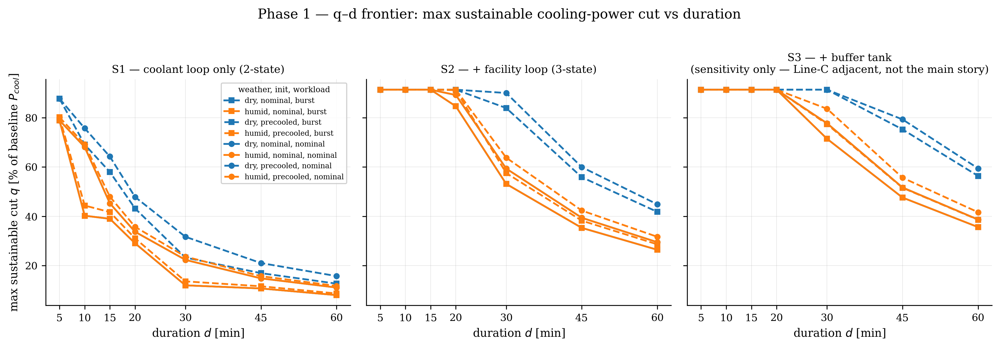

# Phase 1 — DURATION MEMO (GO/NO-GO gate #1)

**Date:** 2026-06-10 · **Inputs:** `config/plant.yaml` (post-Phase-0 calibration),
`experiments/phase1_duration.py` · **Artifacts:** `q_d_frontier.{pdf,png}`,
`frontier.csv`, `key_numbers.json`, `provenance_duration.json`

**Question.** How deep a cooling-power cut can this plant sustain, for how long, before
hitting T_max — and how much does pre-cooling buy?

**Setup.** Open-loop optimal input trajectories over the 5-min model; bisection on the
cut depth q around a feasibility LP (tolerance 20 W). Constraints throughout the event:
T_j ≤ 85 °C, T_in ≥ T_dew + 2 K (inside U(x)), T_f ≤ 35 °C, ṁ/ṁ_nom ∈ [0.3, 1],
T_in ≤ 45 °C, ramp limits. Conservative affine power surrogate (D-006): COP frozen at
the baseline supply temperature (3.80), pump held at nominal — certified cuts are
deliverable with margin. Baseline cooling power **P_base = 288.3 kW** per MW of IT
(pump 25.0 kW + chiller 263.3 kW); T_wb = 22 °C in all cases (D-007). The maximum
instantaneous cut is the chiller share, **91.3% of P_base** (the pump keeps running).

## 1. The q–d frontier

Max sustainable cut, % of baseline cooling power (kW per MW IT in parentheses for the
headline cells). Full table: `frontier.csv`.

| d [min] | S1 nominal-start dry | S1 pre-cooled dry | S2 nominal-start dry | S2 pre-cooled dry | S2 worst¹ | S3² nominal dry |
|---|---|---|---|---|---|---|
| 5  | 78.9 | 87.7 | 91.3 (263) | 91.3 | 91.3 | 91.3 |
| 10 | 68.1 | 75.7 | 91.3 | 91.3 | 91.3 | 91.3 |
| 15 | 45.2 | 64.2 | 91.3 (263) | 91.3 | 91.3 | 91.3 |
| 20 | 33.7 | 47.8 | 89.2 | 91.3 | 84.6 | 91.3 |
| 30 | 22.3 (64) | 31.7 (91) | 59.3 (171) | 90.0 (259) | 53.1 (153) | 77.7 |
| 45 | 14.8 | 21.0 | 39.4 | 59.9 | 35.3 | 51.7 |
| 60 | 11.1 | 15.7 | 29.5 (85) | 44.8 | 26.4 (76) | 38.7 |

¹ *S2 worst = burst workload, nominal start, humid — the most conservative standard case.*
² *S3 = S2 + 30 MJ/K buffer tank — **sensitivity only, Line-C adjacent, not the main story**.*

**Plain-language reading.** The coolant loop alone (S1) is a small battery: it absorbs a
~30% cut for ~20 minutes before the chip hotspot proxy hits its limit, and by 60 minutes
only ~11% is sustainable. Adding the facility loop (S2) changes the product class: the
chiller can be switched off entirely (a 91% cooling-power cut) for 15–20 minutes because
the CDU keeps moving heat into the facility loop's much larger water mass, and a 53–59%
cut survives a full 30 minutes even starting from the nominal state. At the frontier the
trajectories end exactly on the limits (peak T_j = 85.0 °C, peak T_f = 35.0 °C —
`frontier.csv`): the LP uses all the thermal mass there is. At short durations the
binding constraint is not the hotspot but the supply-temperature ceiling: once the loop
return exceeds T_in,max = 45 °C, minimum flow forces residual extraction
(q̇_ext ≥ ṁ_min c_p (T_w − T_in,max)), which caps how completely cooling can be idled —
that is why even S1 at d = 5 min tops out at 79–88% rather than the full 91.3%.

## 2. Sanity check against the literature anchor

The closest neighbor (Chen et al. 2026, LCDC DR potential: **~30% average cut for
~20 min**, capacity–duration trade-off) is matched almost exactly by S1 nominal-start
dry: **33.7% at d = 20 min**, and the whole S1 frontier reproduces the anchored
trade-off shape (deeper ⇒ shorter). Full-depth cuts in S1 survive less than 5 minutes —
consistent with the anchor once depth is accounted for: the literature figure is an
*average* ~30% cut, not chiller-off. S2's full-depth 15–20 min sits in the "tens of
minutes" order the LCDC DR literature describes. No order-of-magnitude anomaly; energy
balance and units were verified in Phase 0 (closure ~1e-16).

## 3. Value of pre-cooling (frontier shift)

Pre-cooling to the condensation floor (ready state, D-012) shifts the frontier out:

- **S1, dry, d = 30:** 22.3% → 31.7% (+9.4 pct-pts; 64 → 91 kW). At d = 15: 45.2% → 64.2%.
- **S2, dry, d = 30:** 59.3% → 90.0% (+30.7 pct-pts; 171 → 259 kW) — pre-cooling nearly
  doubles the 30-min product because the facility loop is pre-chilled 7 K below nominal.
- **Humid kills most of it:** in S1 at d = 30 the pre-cool gain drops from +9.4 (dry) to
  **+1.3 pct-pts** (humid), because the dew-point floor (24 °C) sits 1 K below the
  nominal supply temperature (25 °C) — there is almost nowhere to pre-cool *to*.

The energy/cost of holding the ready state is not priced here (Phase-4 settlement layer;
PARKING_LOT).

## 4. Humidity effect (frontier shrink)

With T_wb held fixed (D-007), humidity acts purely through the condensation floor
T_in ≥ T_dew + 2 K. Nominal-start cases barely move (the floor binds only when cold),
but pre-cooled frontiers shrink materially: S1 pre-cooled at d = 30 drops 31.7% → 23.6%
(−8.0 pct-pts), S2 pre-cooled 90.0% → 63.8%. **The deliverable envelope is
weather-coupled exactly as the project thesis claims:** the dry-day product with
pre-cooling is roughly a third larger than the humid-day product, and certifying offers
without conditioning on dew point would force the humid-day (inner) envelope everywhere.
Asserted programmatically: humid ⊆ dry in every case (no violations).

## 5. Recommendation: product duration d* and plausible q ranges

**Recommend d\* = 30 min.** Rationale:
- At d ≤ 15 the S2/S3 frontier is flat at the 91.3% cap — a 15-min product wastes the
  facility loop's capability and its depth is set by the chiller share, not by thermal
  mass; it is also the regime where the duration-mismatch critique of the literature bites.
- At d = 60 the sustainable depth thins to ~26–30% of P_base nominal-start (76–85 kW/MW),
  still nonzero but with little robustness margin left for Phase-3 tightening.
- At d = 30 the plant holds a deep, certifiable cut in *every* standard case
  (53.1–90.0% of P_base across workload × init × weather in S2).

**Plausible offer range at d\* = 30 (S2):** q ∈ **15–40% of baseline cooling power**
(≈ 45–115 kW per MW of IT), i.e., offer well inside the deterministic frontier
(53.1% worst case) to leave headroom for the contextual-uncertainty tightening and
recourse layers (Phases 2–3) that this open-loop accounting does not yet include.
If only the coolant loop can be certified (S1-class plants or a decoupled facility
loop), d\* = 15 with q ≈ 25–40% is the honest fallback product.

## 6. Gate verdict

**Rule (guide §11):** GO if S2 sustains ≥15–20% of baseline cooling power for d = 30 min.

**Result:** S2 at d = 30 sustains **59.3%** (nominal workload, nominal start, dry),
**53.1%** in the most conservative standard case (burst workload, nominal start, humid)
— 2.7–3× the upper gate threshold. Pre-cooled dry reaches 90.0%.

## **VERDICT: GO.**

The duration-parameterized product (q, d) is physically real at useful depth: the
facility loop is the asset that makes a 30-minute product possible, the coolant loop
alone supports only a 15-minute-class product, and the envelope is strongly
weather-coupled — all three observations directly support the C1 envelope object and
the choice of d as the single institutional model element.

## Caveats (carried forward, all conservative in direction)

1. Power surrogate freezes COP at the baseline supply temperature and holds pump power
   nominal (D-006): realized cuts would be cheaper thermally; frontier is understated.
2. T_wb fixed across weather cases (D-007): isolates the condensation mechanism; COP-
   vs-weather realism returns in Phase 3.
3. Open-loop, known disturbances, frozen exogenous baseline (guide 5.4): no recourse, no
   forecast error — the robust (tightened) frontier of Phases 2–3 will be inside this one.
4. S3 (buffer tank) confirms more mass ⇒ outward frontier shift (e.g., 77.7% vs 59.3% at
   d = 30 nominal); it is reported **as sensitivity only** and will not be promoted
   (guide Line-C caution).
5. Pre-cool holding cost and rebound/recovery energy are not priced here (Phase 4).
